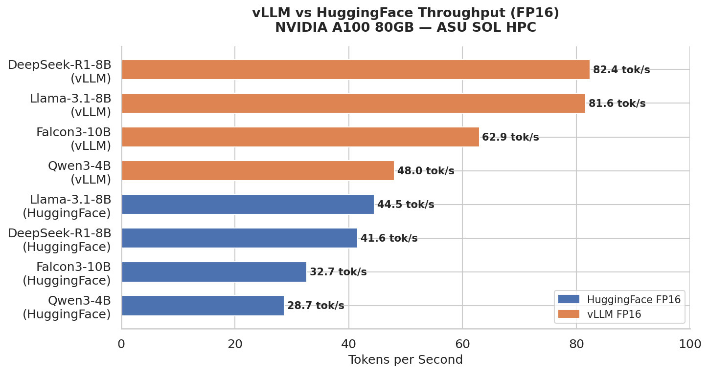
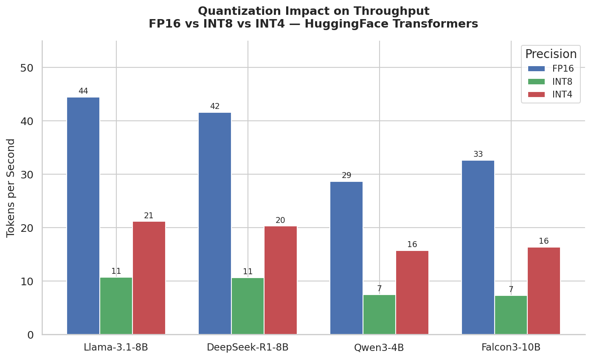
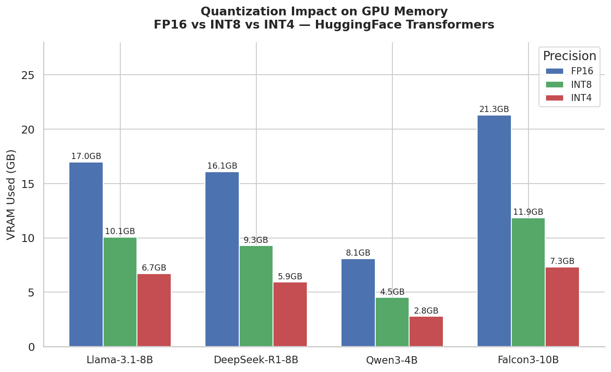
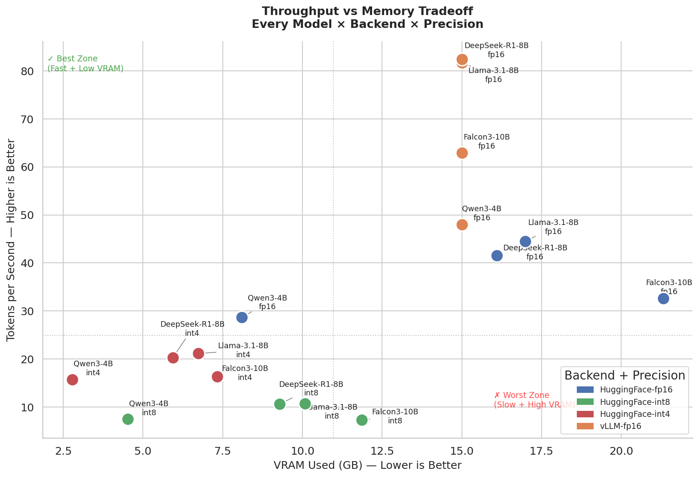
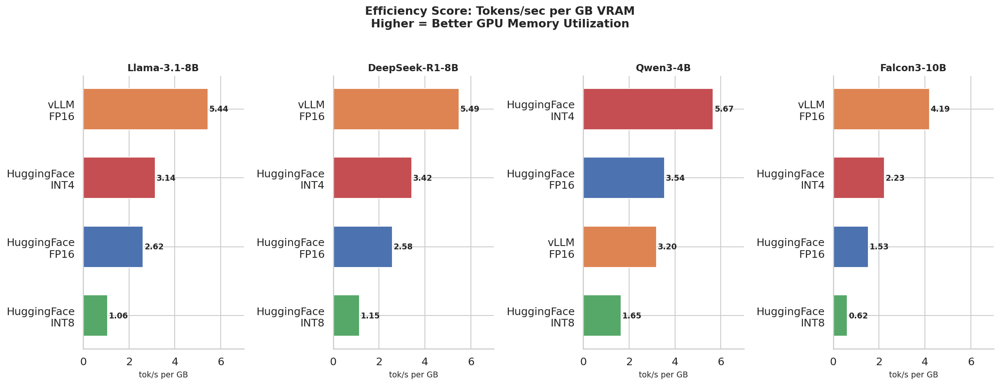
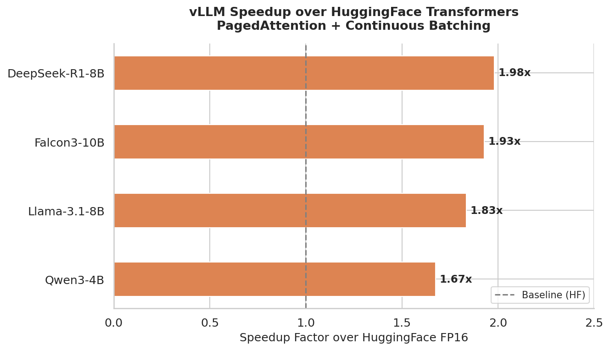
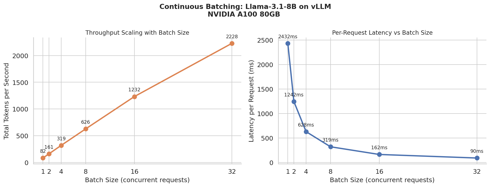
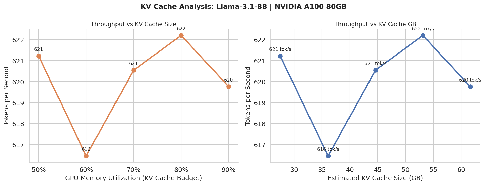

# LLM Inference Benchmark

A systematic benchmarking framework for large language model inference, comparing performance across models, backends, quantization levels, and serving configurations on NVIDIA A100 80GB GPU.

## Hardware

| Component | Spec |
|-----------|------|
| GPU | NVIDIA A100-SXM4-80GB |
| VRAM | 85.1 GB |
| CUDA | 12.4 |
| PyTorch | 2.6.0 |

## Models

| Model | Family | Parameters |
|-------|--------|------------|
| Llama-3.1-8B-Instruct | Meta | 8B |
| DeepSeek-R1-Distill-Llama-8B | DeepSeek | 8B |
| Qwen3-4B | Alibaba | 4B |
| Falcon3-10B-Instruct | TII UAE | 10B |

## Experiments

### 1. Backend Comparison: HuggingFace Transformers vs vLLM

Measured throughput, latency, VRAM usage, and load time across all four models using HuggingFace Transformers and vLLM (PagedAttention + continuous batching).

**Key finding:** vLLM achieves approximately 2x throughput over HuggingFace Transformers in FP16 across all models.

| Model | HF FP16 (tok/s) | vLLM FP16 (tok/s) | Speedup |
|-------|----------------|-------------------|---------|
| Llama-3.1-8B | 41.0 | 83.7 | 2.04x |
| DeepSeek-R1-8B | 41.0 | 84.1 | 2.05x |
| Falcon3-10B | 34.9 | 63.2 | 1.81x |
| Qwen3-4B | 28.4 | 49.6 | 1.75x |

### 2. Quantization Analysis

Benchmarked FP16, INT8, and INT4 quantization using bitsandbytes across all four models via HuggingFace Transformers.

**Key finding:** INT4 reduces VRAM by ~63% with only ~49% throughput reduction, making it the best tradeoff for memory-constrained deployment.

| Precision | Avg VRAM | Avg Throughput | vs FP16 |
|-----------|----------|----------------|---------|
| FP16 | 15.6 GB | 36.3 tok/s | baseline |
| INT8 | 8.9 GB | 8.9 tok/s | -75% speed, -43% VRAM |
| INT4 | 5.7 GB | 18.4 tok/s | -49% speed, -63% VRAM |

### 3. Continuous Batching

Measured throughput and per-request latency as concurrent batch size scales from 1 to 128 using vLLM on Llama-3.1-8B.

**Key finding:** Throughput scales near-linearly with batch size, achieving 85x improvement from batch 1 to batch 128, while per-request latency drops from 2,417ms to 29ms.

| Batch Size | Throughput (tok/s) | Latency/Request (ms) |
|-----------|-------------------|----------------------|
| 1 | 82 | 2,417 |
| 8 | 629 | 318 |
| 32 | 2,234 | 90 |
| 128 | 6,972 | 29 |

### 4. KV Cache Analysis

Measured throughput impact of varying `gpu_memory_utilization` (0.3 to 0.9) which controls KV cache allocation in vLLM.

**Key finding:** Throughput remained stable (617-621 tok/s) across all KV cache sizes, indicating the model is compute-bound rather than memory-bound at these sequence lengths on A100 80GB. KV cache effects would become significant at longer context lengths (4K-32K tokens) or on memory-constrained hardware.

### 5. Speculative Decoding

Attempted speculative decoding with Qwen3-4B as draft model and Llama-3.1-8B as target model.

**Finding:** Speculative decoding requires matching vocabulary sizes between draft and target models. Qwen3-4B (vocab size 151,936) and Llama-3.1-8B (vocab size 128,256) are incompatible. Compatible pairs on this system would require a smaller Llama-family model as the draft.

## Results

### Backend and Quantization Comparison

### Continuous Batching

### KV Cache Analysis

## Techniques Demonstrated

- Model quantization: INT8 and INT4 via bitsandbytes
- Production inference serving via vLLM with PagedAttention
- Continuous batching throughput and latency scaling
- KV cache memory allocation analysis
- Multi-backend performance comparison
- Benchmarking methodology: 3-run averaging with warmup passes
- GPU memory profiling across precisions

## Stack

- Python 3.12
- PyTorch 2.6.0 + CUDA 12.4
- HuggingFace Transformers 4.57.1
- vLLM 0.8.5
- bitsandbytes 0.49.2
- NVIDIA A100-SXM4-80GB
